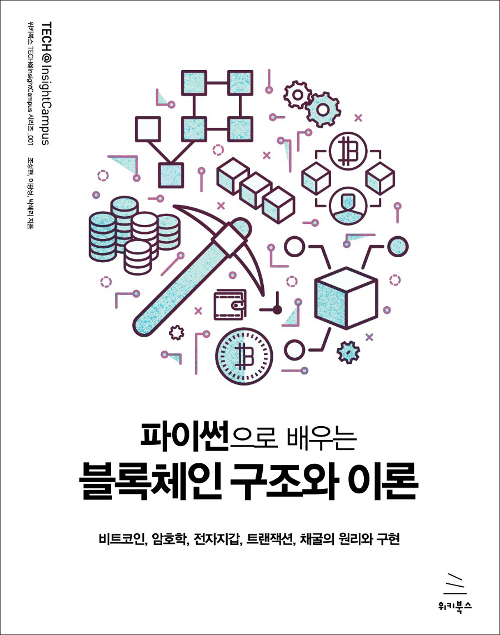

# 파이썬으로 배우는 블록체인 구조와 이론

    

#### 파이썬으로 배우는 블록체인 구조와 이론 Summary

### Ch01. 비트코인 네트워크 개요
---
[Summary(Notion)](https://www.notion.so/nathanh/1-568394d3a1d844a7876426cd9b5251ac)

### Ch02. 암호기술
---
[Summary(Notion)](https://www.notion.so/nathanh/Ch02-0fd4b4ec7bd142d6b8d749f8eea402d4)

### Ch03. 지갑
---
[Summary(Notion)](https://www.notion.so/nathanh/Ch03-eabb14821f694c708f30fca44cf09c3b)

### Ch04. 트랜잭션

### Ch05. 채굴(Mining)

### Ch06. 비트코인 P2P 프로토콜

